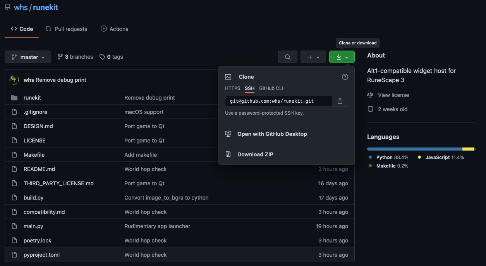
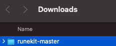
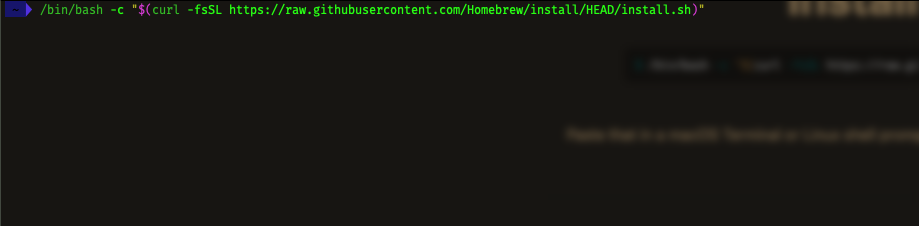
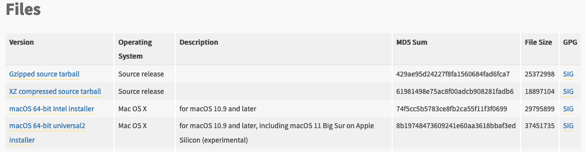

# MacOS Setup (for programming novices)

## Packaged release

[Grab the packaged .app](https://github.com/whs/runekit/releases/tag/platypus-initial)

Note that it might be outdated from the source release

## Running from source

This guide is assuming that you're willing install a few things and run a few commands in your `terminal` application.

Not sure how to open the terminal? You can try this [link](https://lmgtfy.app/?q=how+to+open+terminal+on+mac).

Got your terminal open? Great, time to run some commands.

### (1/4) Downloading this code

But first, we need to download this code. If you know how to use `git` to do that, great. If that last sentence made no sense, keep reading.

We're going to begin by downloading the code as a zip file. You can do this by clicking the green button on the GitHub repo page then clicking `Download Zip`, as shown below:



Then, go ahead and open it with `Archive Utitlity`:


You should now find the folder in your `Downloads` folder (use `Finder` to find it):



Great, we have the code! Next step please.

### (2/4) Installing Homebrew (a package manager)

Basically, follow the instructions on their (Homebrew's) website [here](https://brew.sh/).

Copy the command into your terminal prompt, then hit `enter`:



You can check that this worked by closing and reopening your terminal, then running `which brew`. You should get the following output:


Awesome, we'll need this tool later. For now, on to Python.

### (3/4) Installing Python (3.9.1)

Alright, we're going to install Python the straightforward way. We're going to do that by visiting Python's website [here](https://www.python.org/downloads/release/python-391/) and downloading + running the `macOS 64-bit` installer (which of the two depends on what type of mac you have).



If you're having trouble finding the downloads at the link, remember to scroll to the bottom of the page.

### (4/4) Installing poetry

Run the following command in your terminal:

```bash
brew install poetry
```

### One last thing...

Before you go and run the commands from the other page, you'll want to change what file directory your terminal is in to be the folder where you downloaded `runekit-master`. Assuming you downloaded it as instructed in step 1, you can do this by running the following:

```bash
cd ~/Downloads/runekit-master
```

**Note**: if you close and reopen the terminal, you'll need to renavigate to the correct folder (just rerun the above command).

That simple. Now you can go back to the other file and pick up where you left off, [here](../README.md#running).
